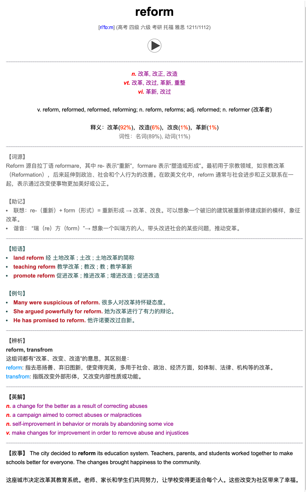

# anki_packager

`anki_packager` 是一个自动化的 Anki 制卡工具，旨在帮助英语学习者高效地创建高质量的单词卡片，并生成可直接导入 Anki 的 `.apkg` 文件。

卡片内容思想深邃、内涵丰富，包含以下信息：

- 正面：词头、发音、音标 + 考试大纲标签（如 中高考、CET4、CET6、GRE 等）
- 背面：
  - 释义：中文（ECDICT）、时态（AI）、释义和词性比例（[《有道词语辨析》加强版](https://skywind.me/blog/archives/2941)）
  - AI 生成词根 + 辅助记忆（联想记忆 + 谐音记忆）
  - 短语 + 例句（有道爬虫）
  - 单词辨析（[单词释义比例词典](https://skywind.me/blog/archives/2938)）
  - 英文释义（目前来自 ECDICT）+ AI 生成故事



## Usage

### conda

建议使用虚拟环境来隔离项目依赖。以下是使用 Conda 的示例：

```bash
# 创建并激活一个名为 apkg 的 Python 3.9 虚拟环境
conda create -n apkg python=3.9
conda activate apkg

# 安装项目依赖
pip install -r requirements.txt

# 查看帮助信息
python -m anki_packager -h
```

### Docker

如果你希望避免污染本地环境，可以使用 Docker 运行 anki_packager：

```shell
# 构建 Docker 镜像 (只需执行一次)
docker build --tag apkg .

# windows 用户
$folder=yourfolderpath # $folder_path="C:\Users\user\mybook\"
# linux/macos
export folder=yourfolderpath # export folder_path="/home/user/mybook/"

docker run --rm --name apkg --mount type=bind,source=$folder,target=/app/
```

如果你不想每次都输入冗长的 Docker 命令，可以使用 Makefile 脚本简化操作：

```shell
# 构建镜像 (只需执行一次)
make build
make run
```

## TODO

- [x] ~~集成单词释义比例词典~~
- [x] 近一步优化单词卡片 UI
- [ ] 支持更多 AI 接口：~~SiliconFlow~~、Gemini
- [ ] 支持 Longman 词典
- [ ] 训练现成的数据包发布 release
- [ ] 从欧路词典导入生词
- [ ] 开发 GUI
- [ ] 发布到 PyPI

## Thanks

- 感谢 [skywind](https://github.com/skywind3000) 开源的 [ECDICT](https://github.com/skywind3000/ECDICT) 以及其他词典项目，为本项目提供了丰富的词典资源。
- 感谢 [yihong0618](https://github.com/yihong0618) 开源的众多优秀 Python 项目，从中获益良多。
