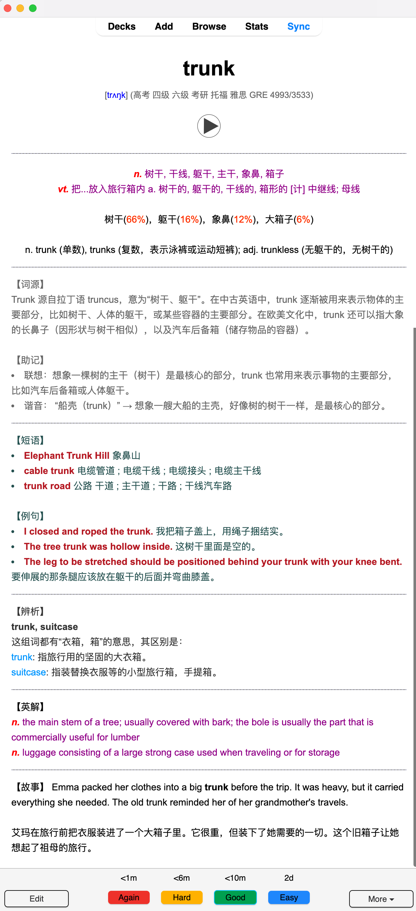

<!-- LOGO -->
<h1>
<p align="center">
  
  <br>anki_packager
</h1>
  <p align="center">
    自动化 Anki 英语单词高质量卡片生成工具
    <br />
    <a href="#关于项目">关于项目</a>
    ·
    <a href="#使用">使用指南</a>
    ·
    <a href="#todo">开发计划</a>
    ·
    <a href="#thanks">致谢</a>
  </p>
</p>

## 关于项目

`anki_packager` 是一款智能化的 Anki 单词卡片生成工具，能够自动创建高质量的 `.apkg` 牌组。本项目致力于为英语学习者提供一个高效、智能的记忆辅助工具。

### 核心特性

- 多源精选词典整合：[ECDICT](https://github.com/skywind3000/ECDICT)、[《有道词语辨析》加强版](https://skywind.me/blog/archives/2941)、[单词释义比例词典](https://skywind.me/blog/archives/2938)
- 智能化学习体验：
  - 自动抓取有道词典优质例句和常用短语
  - 支持谷歌 TTS 发音、中英双解、考纲标记等功能
  - 支持流行 AI 模型（需要 API-KEY）对单词进行总结、助记及和情境故事生成
- 便捷的数据导入：支持欧路词典生词本一键导入并批量处理单词列表，自动生成卡片
- 优良的命令行体验：显示处理进度，支持记录错误、支持丰富的命令行参数
- 支持 Docker 运行

### 卡片预览

每张单词卡片包含丰富的学习资源，结构清晰，内容全面：

- 正面：词头、发音、音标 + 考试大纲标签（如 中高考、CET4、CET6、GRE 等）
- 背面：
  - 释义：中文（ECDICT）、时态（AI）、释义和词性比例（[《有道词语辨析》加强版](https://skywind.me/blog/archives/2941)）
  - AI 生成词根 + 辅助记忆（联想记忆 + 谐音记忆）
  - 短语 + 例句（有道爬虫）
  - 单词辨析（[单词释义比例词典](https://skywind.me/blog/archives/2938)）
  - 英文释义（目前来自 ECDICT）+ AI 生成故事



## 使用

### 快速开始

1. **克隆项目**

```bash
# 因为本项目包含子模块，克隆时请使用以下命令
git clone --recursive https://github.com/yaoyhu/anki_packager.git
```

2. **正确配置**

在使用 anki_packager 之前，你需要先进行配置。请在 `config/config.json` 文件中填写相关配置信息：

1. 生词默认放在 `config/vocabulary.txt`
2. 如果需要用 AI 必须配置 `API_KEY`、`MODEL`、`API_BASE`和 `PROXY`
3. 如果需要使用欧路词典生词本：先按照[欧陆官方获取](https://my.eudic.net/OpenAPI/Authorization) TOKEN，然后使用`python -m anki_packager --eudicid` 选择 ID 写入配置文件

### 运行

#### 方式一：Conda 环境（推荐）

```bash
# 创建并激活一个名为 apkg 的 Python 3.9 虚拟环境
conda create -n apkg python=3.9
conda activate apkg

# 安装项目依赖
pip install -r requirements.txt

# 查看帮助信息
python -m anki_packager -h

# 从欧路词典生词本导出单词，生成卡片（需要先配置)
python -m anki_packager --eudic

# 关闭 AI 功能
python -m anki_packager --disable_ai

# 从生词本读词生成卡片
python -m anki_packager
```

#### 方式二：Docker 容器

如果你希望避免污染本地环境，可以使用 Docker 运行 anki_packager，可以配合 `Makefile` 使用：

```shell
# 构建 Docker 镜像 和 创建持久化卷
make build

# 第一次运行容器下载词典（需要一点时间）
make run

# 进入容器（注意！需要在主机先配置 config/config.json）
# 在容器中运行 anki_packager，生成的牌组会保存在当前目录中
make shell
```

## TODO

- [x] ~~集成单词释义比例词典~~
- [x] ~~近一步优化单词卡片 UI~~
- [x] ~~从欧路词典导入生词~~
- [x] ~~支持 SiliconFlow、Gemini~~
- [x] 重新支持 Docker
- [ ] 发布到 PyPI
- [ ] 支持更多软件生词导出
- [ ] 支持 Longman 词典
- [ ] 训练现成的数据包发布 release
- [ ] 开发 GUI

## Thanks

本项目得到了众多开源项目和社区的支持：

- 感谢 [skywind](https://github.com/skywind3000) 开源的 [ECDICT](https://github.com/skywind3000/ECDICT) 以及其他词典项目，为本项目提供了丰富的词典资源。
- 感谢 [yihong0618](https://github.com/yihong0618) 开源的众多优秀 Python 项目，从中获益良多。

---

<p align="center">如果这个项目对你有帮助，欢迎 Star ⭐️</p>
